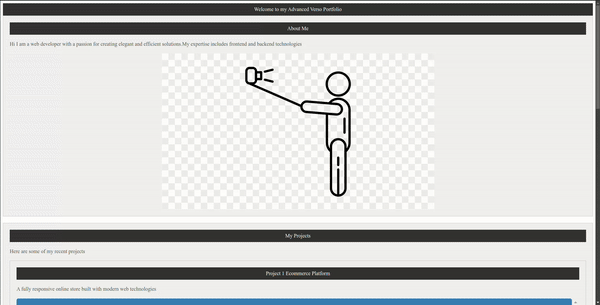

# Compilador Verso-language

## Visão Geral
Verso-language é um compilador desenvolvido como parte de um projeto da disciplina de Compiladores. Ele processa uma linguagem de marcação simples chamada Verso, que permite a criação de layouts de página estruturados, e gera código HTML correspondente.

## Estrutura do Projeto
O projeto é estruturado como uma aplicação Java Maven, com os seguintes componentes principais:

- `VersoSemanticAnalyzer.java`: Realiza a análise semântica e gera o HTML.
- `Principal.java`: Ponto de entrada do programa e coordena o processo de compilação.
- `MyCustomErrorListener.java`: Lida com o tratamento de erros sintáticos.
- `HtmlCodeGenerator.java`: Gera o código HTML com estilos CSS embutidos.
- `VersoUtils.java`: Contém utilidades e estruturas de dados usadas em todo o compilador.
- `Scope.java` e `SymbolsTable.java`: Gerenciam o escopo e a tabela de símbolos.
- `ErrorOcurred.java`: Controla o estado de ocorrência de erros.


## Verso.g4 (Definição da Gramática)

O arquivo **`verso.g4`** contém a definição da gramática utilizada pelo compilador Verso para analisar e processar a linguagem Verso. Essa gramática é responsável por definir as palavras-chave, regras de tokens, símbolos não reconhecidos e as regras de produção que descrevem a estrutura sintática da linguagem.

### Palavras-chave
As principais palavras reservadas da linguagem Verso são definidas abaixo:

- **`PAGE`**: Define o elemento raiz de uma página.
- **`SECTION`**: Agrupa outros elementos.
- **`HEADER`**: Define um cabeçalho.
- **`FOOTER`**: Define um rodapé.
- **`PARAGRAPH`**: Define um parágrafo de texto.
- **`IMAGE`**: Insere uma imagem (exige um atributo `alt`).
- **`LINK`**: Cria um link (exige um URL e texto de ancoragem).

### Regras de Tokens
Essas regras definem como os diferentes elementos da linguagem são identificados e processados. Por exemplo, as strings, textos e os espaços em branco são interpretados como tokens pela gramática.

- **`STRING`**: Identifica qualquer sequência de caracteres entre aspas.
- **`TEXT`**: Identifica qualquer sequência de caracteres alfanuméricos, que formam o texto principal da linguagem.
- **`WS`**: Representa espaços em branco, que são ignorados durante a análise sintática.

### Símbolos Não Reconhecidos
A linguagem define um conjunto de símbolos que não são reconhecidos pela gramática e, portanto, são considerados erros sintáticos:

- **ERRO**: Inclui caracteres como `~`, `$`, `}`, `|`, `!`, `@`, `{`, que não fazem parte da sintaxe válida da linguagem Verso.

### Regras de Produção
Essas são as regras que descrevem como os elementos da linguagem Verso são compostos. Elas indicam como os elementos básicos, como `page`, `section`, `header`, e outros, devem ser combinados para formar uma estrutura válida em Verso.

- **`layout`**: Define a estrutura geral de uma página, que começa com a palavra-chave `PAGE` e contém múltiplos elementos.
- **`page`**: Define o início de uma página, que pode conter seções, cabeçalhos, rodapés, parágrafos, imagens e links.
- **`section`**: Uma seção que pode conter outros elementos dentro dela.
- **`header`** e **`footer`**: Cabeçalhos e rodapés contêm texto simples.
- **`paragraph`**: Um parágrafo de texto.
- **`image`**: Um elemento de imagem com um caminho especificado entre parênteses e um atributo `alt` opcional.
- **`link`**: Um link que contém um URL e o texto que será exibido.

### Exemplo da Gramática

Aqui está a definição completa da gramática:

```antlr
grammar Verso;

// Palavras-chave
PAGE: 'page';
SECTION: 'section';
HEADER: 'header';
FOOTER: 'footer';
PARAGRAPH: 'paragraph';
IMAGE: 'image';
LINK: 'link';
ALT: 'alt';
HREF: 'href';

// Regras de tokens
STRING : '"' ( ~["\r\n] | '""' )* '"';
TEXT: [a-zA-Z0-9]+ ( ' ' [a-zA-Z0-9]+ | '.' )*;
WS 	:	( ' ' |'\t' | '\r' | '\n') -> skip
	;

// Simbolos não reconhecidos na linguagem
ERRO: '~' | '$' | '}' | '|' | '!' | '@' | '{' ;

// Regras de produção
layout: page EOF;

page: PAGE '{' content* '}';

content: section
       | header
       | footer
       | paragraph
       | image
       | link;

section: SECTION '{' content* '}';

header: HEADER '{' text '}';

footer: FOOTER '{' text '}';

paragraph: PARAGRAPH '{' text '}';

image: IMAGE '(' STRING ')' attribute?;

link: LINK '(' STRING ')' '{' text '}';

attribute: ALT '=' STRING
         | HREF '=' STRING;

text: TEXT+;
```


### Análise Semântica
O compilador realiza verificações semânticas, incluindo:
- Validação de conteúdo mínimo em páginas e seções.
- Verificação de texto em cabeçalhos, rodapés e parágrafos.
- Validação de atributos obrigatórios em imagens e links.

### Geração de HTML
O compilador gera código HTML semanticamente correto com estilos CSS embutidos para melhorar a apresentação visual.

## Como Usar

### Pré-requisitos
- Java JDK 15 ou superior
- Maven

### Compilação
```
mvn clean package
```

### Execução
```
java -jar target/verso-1.0-SNAPSHOT-jar-with-dependencies.jar input.verso output.html
```

## OU

```
./run.sh
```

Onde:
- `input.verso` é o arquivo de entrada contendo o código Verso
- `output.html` é o arquivo de saída onde o HTML gerado será escrito

## Tratamento de Erros
- Erros sintáticos são capturados pelo `MyCustomErrorListener` e reportados com informações sobre a linha e o tipo de erro.
- Erros semânticos são coletados durante a análise e reportados no final do processo.

## Exemplo de Código Verso
```
page {
    header {
        Welcome to my Verso page
    }
    section {
        paragraph { This is a sample paragraph. }
        image ("example.jpg") alt="An example image"
        link ("https://example.com") { Click here for more }
    }
    footer {
        © 2024 My Verso Site
    }
}
```

## Exemplo de HTML gerado
```
<!DOCTYPE html lang="pt-BR">

<head>
    <style>
        section {
            padding: 20px;
            background-color: #f0f0f0;
            border: 1px solid #ccc;
            margin-bottom: 20px;
        }

        header,
        footer {
            background-color: #333;
            color: white;
            text-align: center;
            padding: 10px 0;
        }

        p {
            font-size: 16px;
            color: #555;
            line-height: 1.6;
        }

        img {
            max-width: 100%;
            height: auto;
            display: block;
            margin: 0 auto;
        }

        a {
            color: #3498db;
            text-decoration: none;
        }

        a:hover {
            text-decoration: underline;
        }
    </style>
</head>

<body>
    <header>Welcome to my Verso page</header>
    <section>
        <p>This is a sample paragraph.</p>
        
        <a href="https://example.com">Click here for more</a>
    </section>
    <footer>2024 My Verso Site</footer>
</body>

</html>
```


## Exemplo mais elaborado

```
page {
    header {
        Welcome to my Advanced Verso Portfolio
    }
    section {
        header {
            About Me
        }
        paragraph {
            Hi I am a web developer with a passion for creating elegant and efficient solutions.

            My expertise includes frontend and backend technologies
        }
        image ("profile.png") alt="A professional headshot of me"
    }
    section {
        header {
            My Projects
        }
        paragraph {
            Here are some of my recent projects
        }
        section {
            header {
                Project 1 Ecommerce Platform
            }
            paragraph {
                A fully responsive online store built with modern web technologies
            }
            image ("ecommerce.png") alt="Screenshot of the ecommerce platform"
            link ("https://github.com/myuser/ecommerce") {
                View on GitHub
            }
        }
        section {
            header {
                Project 2 Weather App
            }
            paragraph {
                A realtime weather application using geolocation and weather APIs
            }
            image ("weatherapp.png") alt="Interface of the weather application"
            link ("https://myweatherapp.com") {
                Try it out
            }
        }
    }
    section {
        header {
            Contact Me
        }
        paragraph {
            Feel free to reach out for collaborations or questions
        }
        link ("eduardospinelli1@gmail.com") {
            Email Me
        }
        link ("https://www.linkedin.com/in/eduardo-spinelli-a309011a1/") {
            Connect on LinkedIn
        }
    }
    footer {
        2024 My Professional Portfolio Built with Verso language
    }
}
```



## Autores:
- [Vinícius Romualdo](https://github.com/vinimrs)
- [Matheus Bessa](https://github.com/mthsB3ssa)
- [Eduardo Spinelli](https://github.com/Edu-Spinelli)
