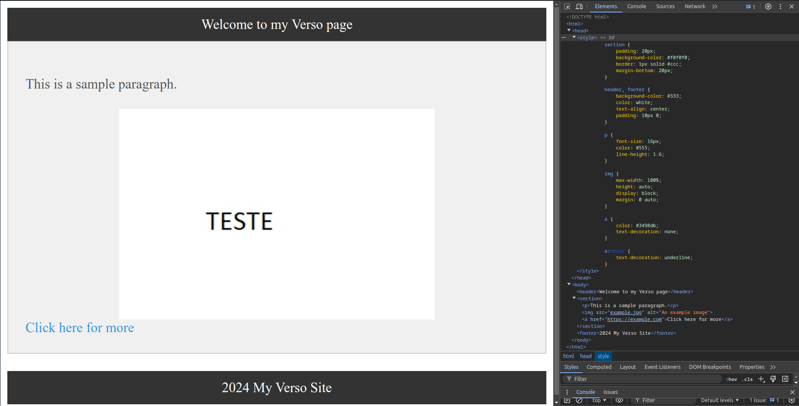

# Compilador Verso-language

## Visão Geral
Verso-language é um compilador desenvolvido como parte de um projeto da disciplina de Compiladores. Ele processa uma linguagem de marcação simples chamada Verso, que permite a criação de layouts de página estruturados, e gera código HTML correspondente.

## Estrutura do Projeto
O projeto é estruturado como uma aplicação Java Maven, com os seguintes componentes principais:

- `VersoSemanticAnalyzer.java`: Realiza a análise semântica e gera o HTML.
- `Principal.java`: Ponto de entrada do programa e coordena o processo de compilação.
- `MyCustomErrorListener.java`: Lida com o tratamento de erros sintáticos.
- `HtmlCodeGenerator.java`: Gera o código HTML com estilos CSS embutidos.
- `VersoUtils.java`: Contém utilidades e estruturas de dados usadas em todo o compilador.
- `Scope.java` e `SymbolsTable.java`: Gerenciam o escopo e a tabela de símbolos.
- `ErrorOcurred.java`: Controla o estado de ocorrência de erros.

## Funcionalidades

### Elementos da Linguagem Verso
- `page`: Elemento raiz que contém todo o conteúdo.
- `section`: Agrupa outros elementos.
- `header`: Define um cabeçalho.
- `footer`: Define um rodapé.
- `paragraph`: Define um parágrafo de texto.
- `image`: Insere uma imagem (requer atributo `alt`).
- `link`: Cria um link (requer URL e texto de ancoragem).

### Análise Semântica
O compilador realiza verificações semânticas, incluindo:
- Validação de conteúdo mínimo em páginas e seções.
- Verificação de texto em cabeçalhos, rodapés e parágrafos.
- Validação de atributos obrigatórios em imagens e links.

### Geração de HTML
O compilador gera código HTML semanticamente correto com estilos CSS embutidos para melhorar a apresentação visual.

## Como Usar

### Pré-requisitos
- Java JDK 15 ou superior
- Maven

### Compilação
```
mvn clean package
```

### Execução
```
java -jar target/verso-1.0-SNAPSHOT-jar-with-dependencies.jar input.verso output.html
```

Onde:
- `input.verso` é o arquivo de entrada contendo o código Verso
- `output.html` é o arquivo de saída onde o HTML gerado será escrito

## Tratamento de Erros
- Erros sintáticos são capturados pelo `MyCustomErrorListener` e reportados com informações sobre a linha e o tipo de erro.
- Erros semânticos são coletados durante a análise e reportados no final do processo.

## Exemplo de Código Verso
```
page {
    header {
        Welcome to my Verso page
    }
    section {
        paragraph { This is a sample paragraph. }
        image ("example.jpg") alt="An example image"
        link ("https://example.com") { Click here for more }
    }
    footer {
        © 2024 My Verso Site
    }
}
```

## Exemplo de HTML gerado
```
<!DOCTYPE html lang="pt-BR">

<head>
    <style>
        section {
            padding: 20px;
            background-color: #f0f0f0;
            border: 1px solid #ccc;
            margin-bottom: 20px;
        }

        header,
        footer {
            background-color: #333;
            color: white;
            text-align: center;
            padding: 10px 0;
        }

        p {
            font-size: 16px;
            color: #555;
            line-height: 1.6;
        }

        img {
            max-width: 100%;
            height: auto;
            display: block;
            margin: 0 auto;
        }

        a {
            color: #3498db;
            text-decoration: none;
        }

        a:hover {
            text-decoration: underline;
        }
    </style>
</head>

<body>
    <header>Welcome to my Verso page</header>
    <section>
        <p>This is a sample paragraph.</p>
        
        <a href="https://example.com">Click here for more</a>
    </section>
    <footer>2024 My Verso Site</footer>
</body>

</html>
```




## Autores:
- [Vinícius Romualdo](https://github.com/vinimrs)
- [Matheus Bessa](https://github.com/mthsB3ssa)
- [Eduardo Spinelli](https://github.com/Edu-Spinelli)
